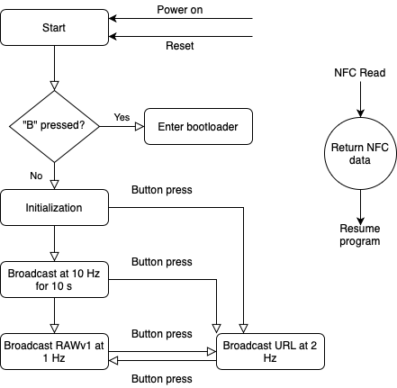

# 1.2.12

Ruuvi Firmware 1.2.12 was the first firmware to be continuously produced for RuuviTags shipped from Ruuvi Shop. The factory firmware was updated on 2019-12 and no new tags with this firmware is produced anymore, but you might still find the FW on some tags.

| Feature | Status |
| :--- | :--- |
| **NFC** | Supported, NFC read may hang in rare cases and reboot is required. |
| Record 0: Text, "id" | "ID: " +  XX:XX:XX:XX:XX:XX:XX:XX representing tag ID, 8 bytes. |
| Record 1: Text, "ad" | "MAC: " + XX:XX:XX:XX:XX:XX representing tag Bluetooth address, 6 bytes. |
| Record 2: Text, "sw" | "SW: Ruuvi 1.2.12" |
| Record 3: Text, "dt" | "Data:" |
| **Bluetooth** | Non-connectable, non-scannable advertisements are supported. |
| URL advertising \(format 4\) | Supported, 2 Hz advertising. Green led blinks. |
| RAWv1 advertising \(format 3\) | Supported, 1 Hz advertising. Red led blinks. |
| **Button** | One software button + reset button supported. |
| "B" short press | Chage between advertising mode 1, 2  |
| "B" pressed on boot | Enter bootloader |
| "R" sort press | Reboot |
| Hold down "B", press "R" | Enter bootloader |
| **Sensors** | **A**cceleration, **H**umidity, **T**emperature, **P**ressure, **V**oltage |
| BME280 \(H, T, P\) | Supported, continuous mode, 1 Hz, 16x IIR low-pass filtering, ~60 seconds step response |
| LIS2DH12 \(A\) | Supported, continuous mode, 1 Hz, no filtering, ~0.5 Hz bandwidth. |
| nRF52 \(T, V\) | Supported, measures temperature only if BME280 is not present on board. Battery voltage measurement is not synchronized to loading of device which may cause noisy readings or missed droops. |
| **Battery life** |  |
| URL mode | 2 years expected in room temperature |
| RAW mode | 3 years expected in room temperature |

