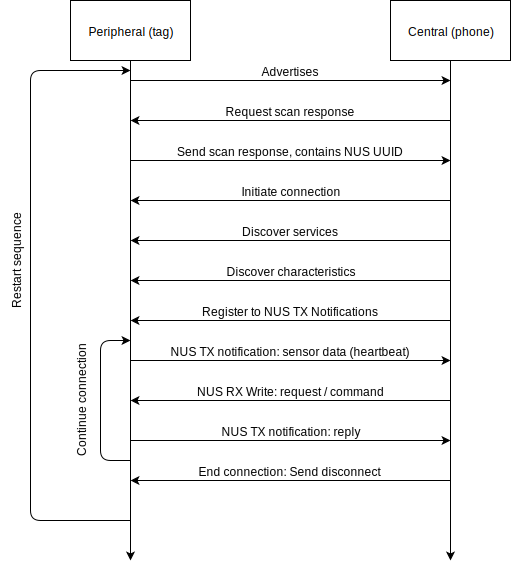

# Bluetooth connection

### **Creating a connection**

The Ruuvi advertises itself in connectable, scannable mode in 1 MBit / s PHY. The scan response contains full device name “Ruuvi XXXX” and UUID of Nordic UART Service \(NUS\). 

The central must request for scan responses \(active scan\) and connect to a device with matching scan response. Advertising payload should be ignored. 

The Ruuvi has 3 services: Nordic Buttonless DFU service \(DFU\), Device Information Service \(DIS\) and NUS. NUS is used for most of the application communication with the device.

In development versions of firmware there is 120 second delay from starting of the connection in which the central must complete the registration process and register to NUS TX Notfications. If the deadline is not met, tag assumes that there is a software lockup and reboots. In production versions this deadline is 12 seconds. 

