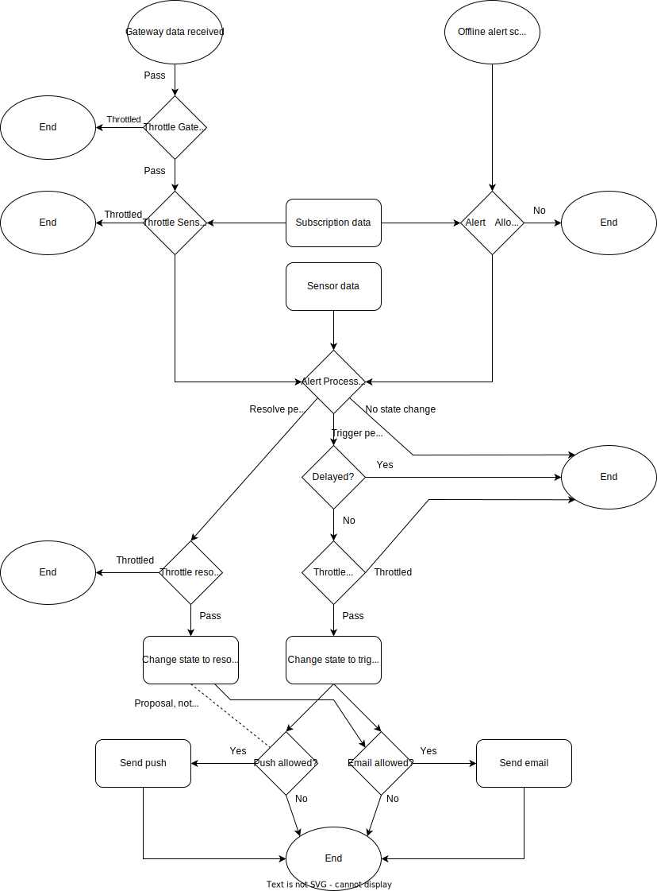

# Alerts

Ruuvi Cloud supports sending alert notifications based on user-configured settings. This page describes what accout levels have access to which alerts and how they are sent.&#x20;

The alerts can be received as UI icon in apps or station.ruuvi.com dashboard, through push notification in mobile apps and emails.&#x20;

<figure><figcaption>
UI Notification
</figcaption></figure>

<figure><figcaption>
Push notification
</figcaption></figure>

<figure><figcaption>
Email alert
</figcaption></figure>

<table><thead><tr><th>Alert channel</th><th width="100">Free</th><th width="100">Basic</th><th width="100">Pro</th><th width="100">Business</th></tr></thead><tbody><tr><td>UI Icon</td><td>Yes</td><td>Yes</td><td>Yes</td><td>Yes</td></tr><tr><td>Push notification</td><td>No</td><td>Yes</td><td>Yes</td><td>Yes</td></tr><tr><td>Email</td><td>No</td><td>No</td><td>Yes</td><td>Yes</td></tr></tbody></table>

There are different type of alerts you can configure for yourself, the table below lists which alerts are allowed for which account types.&#x20;

Alerts marked with \* are under development and expected to be available by summer 2023.&#x20;

<table><thead><tr><th>Alert type</th><th width="100">Free</th><th width="100">Basic</th><th width="100">Pro</th><th width="100">Business</th></tr></thead><tbody><tr><td>Temperature</td><td>Yes</td><td>Yes</td><td>Yes</td><td>Yes</td></tr><tr><td>Humidity</td><td>Yes</td><td>Yes</td><td>Yes</td><td>Yes</td></tr><tr><td>Air pressure</td><td>Yes</td><td>Yes</td><td>Yes</td><td>Yes</td></tr><tr><td>Movement</td><td>Yes</td><td>Yes</td><td>Yes</td><td>Yes</td></tr><tr><td>Signal level</td><td>Yes</td><td>Yes</td><td>Yes</td><td>Yes</td></tr><tr><td>No data*</td><td>No</td><td>No</td><td>Yes</td><td>Yes</td></tr><tr><td>Delayed trigger*</td><td>No</td><td>No</td><td>No</td><td>Yes</td></tr></tbody></table>

Alerts trigger once and wait until they are resolved before they can be triggered again. However, reconfiguring an alert such as adjusting alert trigger limits or disabling and re-enabling it will always resolve alert, which leads to a new trigger if the alert condition remains after reconfigruration. Image below shows trigger-events with red arrow and resolve-events with blue arrow.&#x20;

Additionally, alerts can trigger at most once per hour for user and alert per sensor, this reduces spam in case where e.g. fridge swings back and forth the alert thresholds. Business users can configure delay before triggering an alert for e.g. walk-in freezers which might spike up for a short while when someone enters and then drop back to allowed range.&#x20;

<figure><figcaption>
Alert triggering and getting resolved
</figcaption></figure>

For full details of alert triggering and resolving logic, please see the following flowchart.

<figure><figcaption></figcaption></figure>

