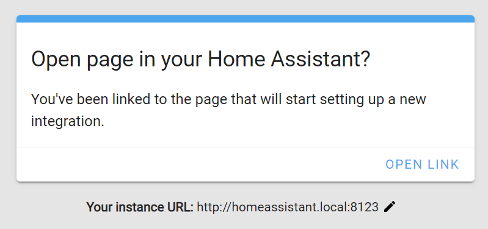

# Real Time Transfer \(RTT\)

RuuviTags are nRF52-based devices. The programming is done over Serial Wire Debug \(SWD\) interface through nRF52 devkit. The RuuviTag can be interfaced to nRF52-DK either through [Ruuvi Devshield](https://shop.ruuvi.com/product/devkit/) or a [Tag-Connect cable](http://www.tag-connect.com/TC2030-CTX-NL).

The Real-Time Transfer is Segger's technology for printing UART-like messages from the attached Cortex-M device. Test versions of Ruuvi Firmware print out the logs via RTT which can be useful for example when developing your own applications which communicate over GATT. 

**Connecting the hardware**

First you'll need to connect your PC to nRF52-DK via USB-micro cable, then you'll need to connect the nRF52-DK to Ruuvi via devkit or the Tag-Connect cable. nRF52-DK autodetects an external target and programs it, but if there is an issue with connection you can get errors from the software or program the nRF52 onboard the nRF52-DK. You can cut the power measurement jumper on nRF52-DK to be sure to not accidentally connect to the wrong nRF52. 

If you get a Tag-Connect cable, be sure to get the 10-pin connector Cortex-M no-legs version or you'll need to solder the wires to pins on DK as above.

**Software connection**

You'll need to install[ Segger software and documentation pack](https://www.segger.com/downloads/jlink/). On Windows you can use JLinkRTTViewer which has a GUI for connecting to device and storing the logs to a file, on Linux and Mac OSX you have to use JLinkExe to connect to the Ruuvi and JLinkRTTClient to view the logs.

JLinkExe has to be started first, commands are

* _connect_
* Device -&gt; _NRF52832\_XXAA_
* Interface -&gt; _s_ \(SWD\)
* Speed -&gt; _4000_ \(kHz\)
* Restart program and halt -&gt; _r_
* Once JLinkRTTViewer is connected, go -&gt; _g_

JLinkRTTClient will connect automatically to the JLinkExe session, just start JLinkRTTClient and start the firmware program on JLinkExe with _g._

