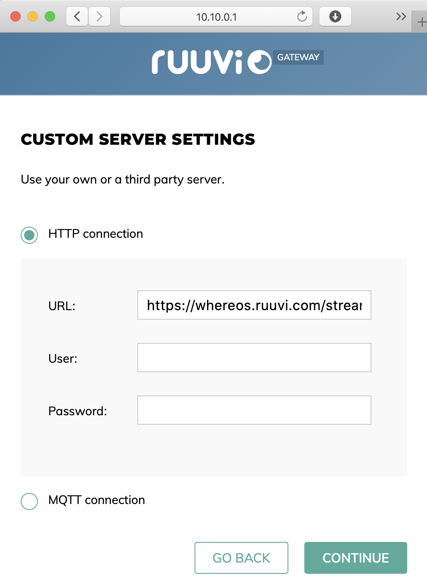
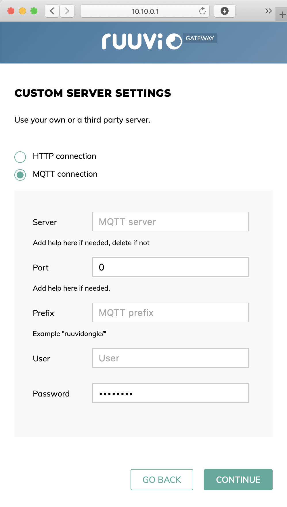
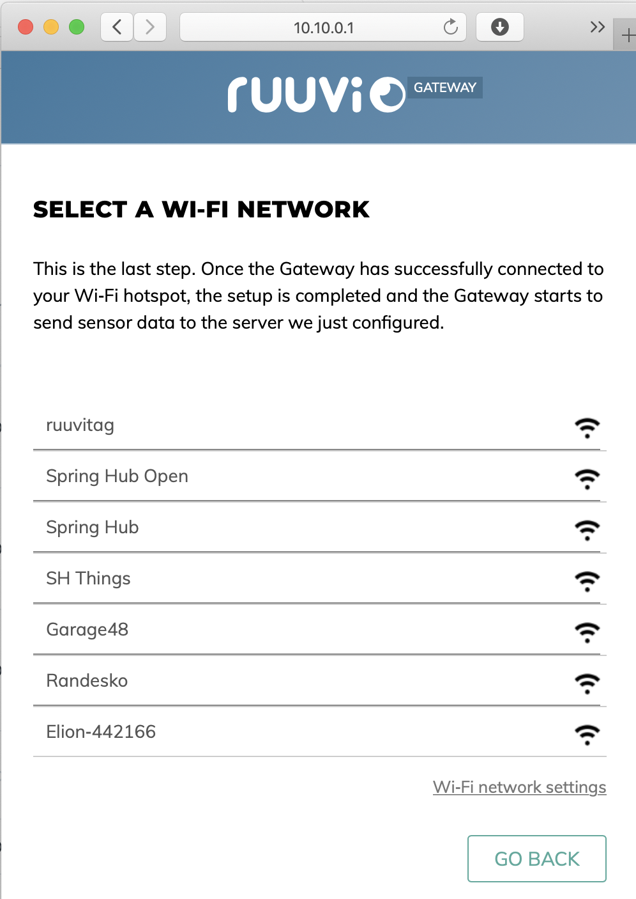
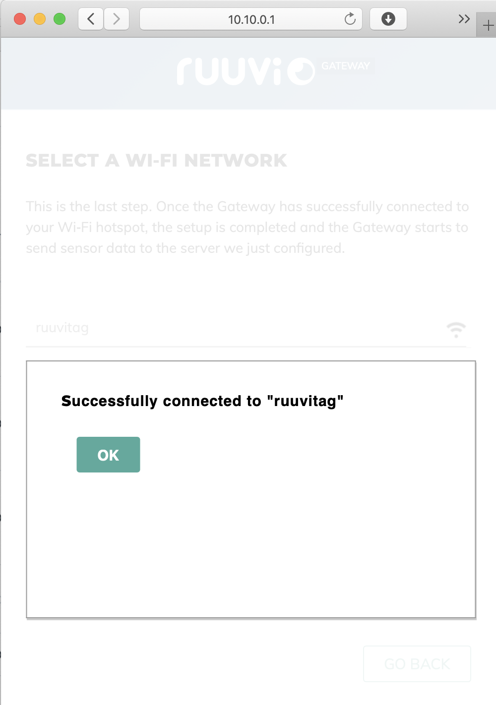
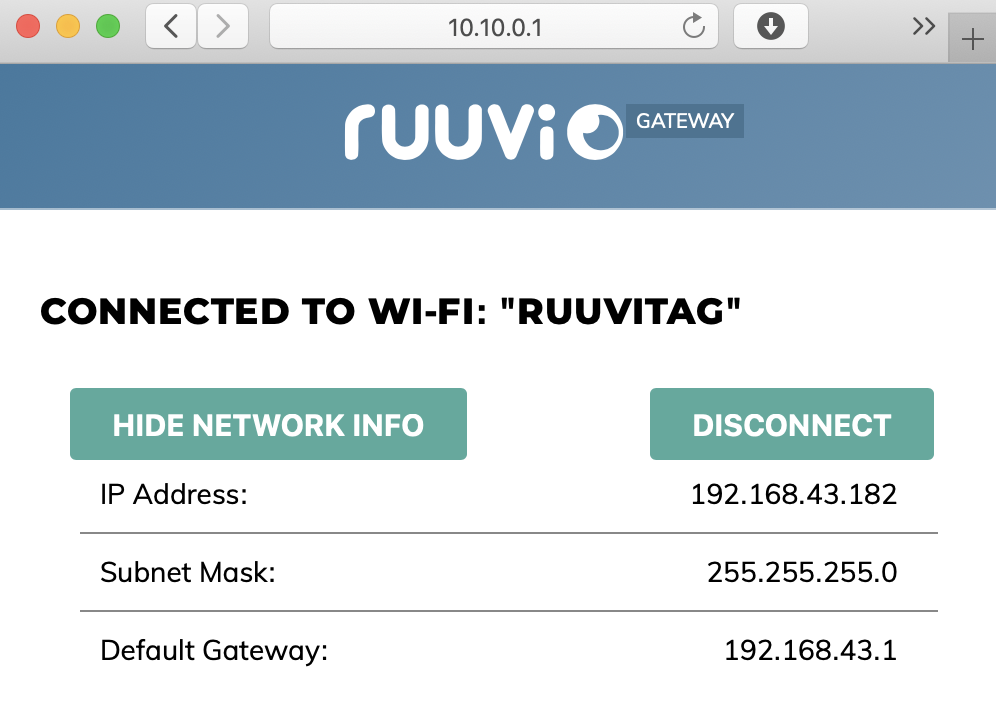
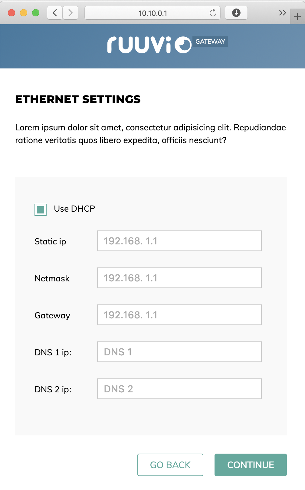
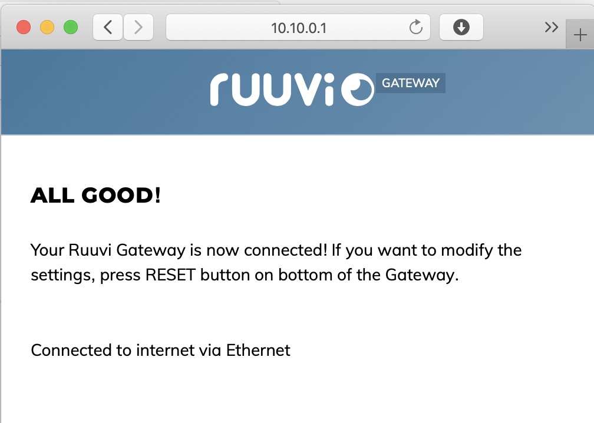

# index.html

## User interface

Ruuvi Gateway sets up a WiFi hotspot and a webserver which provides user interface for configuration over HTTP. The user interface can be accessed in any major browser. To connect to the user interface connect to hotspot "**RuuviGateway XXXX**" and enter password "**12345678**". Once connected, open your browser and enter **http://10.10.0.1** .

### Greeting window

### Backend selection

#### Backend A\) HTTP\(S\)

#### Backend B\) MQTT

### Scan settings

### Internet connection settings

#### Internet connection A\) WiFi

TODO: Remove "Hide network info" -option, remove "disconnect" option, add "Turn off configuration hotspot" -option, add "Go back" option \(possibly disconnect if go back is selected\). 

#### 

#### Internet connection B\) Ethernet

TODO: Make "Use DHCP" a radio button and add "Advanced configuration" as another option, similar to backend and scan option selection. 

After clicking continue, show similar "connection" animation as in WiFi, and show written / animated instructions to connect Ethernet cable. 

TODO: Use same view as in WiFi connection successful.

## Configurable settings

| Setting | Type | Possible values | Lifecycle | Since version | Default |
| :--- | :--- | :--- | :--- | :--- | :--- |
| WiFi SSID | String | Up to 50 printable characters | Alpha | 1.0 | "" |
| WiFi password | String | Up to 50 printable characters. | Alpha | 1.0 | "" |
| Location | String | Up to 50 printable characters. | Alpha | 1.0 | "" |
| Use Ruuvi Network | Boolean | True, False | Proposal |  | True |
| Use HTTP | Boolean | True, False. | Beta | 1.0 | True |
| HTTP URL | String | Up to 255 printable characters. | Beta | 1.0 | "https://network.ruuvi.com/record" |
| HTTP User | String | Up to 50 printable characters. | Alpha | 1.2 | "" |
| HTTP Password | String | Up to 50 printable characters. | Alpha | 1.2 | "" |
| HTTP Port | uint16 | 1 ... 65536. | Alpha | 1.2 | 443 |
| Use MQTT | Boolean | True, False. | Beta | 1.0 | False |
| MQTT URL | String | Up to 255 printable characters. | Beta | 1.0 | "" |
| MQTT Prefix | String | Up to 50 printable characters. | Beta | 1.0 | "" |
| MQTT User | String | Up to 50 printable characters. | Beta | 1.0 | "" |
| MQTT Password | String | Up to 50 printable characters. | Beta | 1.0 | "" |
| MQTT Port | uint16 | 1 ... 65536. | Beta | 1.0 | 1883 |
| Filter tags | Boolean | True, False. | Alpha | 1.0 | true |
| Filter | uint16 | Any BLE SIG member ID, MSB first. | Alpha | 1.0 | 0x0499 \(Ruuvi\) |
| Scan Coded PHY | Boolean | True, False | Proposal |  | False |
| Scan 1 MBit / s PHY | Boolean | True, False | Proposal |  | True |
| Scan extended payloads | Boolean | True, False | Proposal |  | True |
| Scan channel 37 | Boolean | True, False | Proposal |  | True |
| Scan channel 38 | Boolean | True, False | Proposal |  | True |
| Scan channel 39 | Boolean | True, False | Proposal |  | True |

## Description of settings

**WiFi SSID** Name of WiFi to connect to. Example: "Home WiFi". Optional.

**WiFi Password** Password of the WiFi. Example: "Ruuv1Tag". Optional.

**Location** Coordinate pair or human readable location. Example: If coordinate pair, write it as "{59.409330, 24.735369}", without quotes. Otherwise any string, such as "Ruuvi's Office". Oprional.

**Use Ruuvi Network** If yes, use default settings for everything exept WiFi and location. Mandatory.

**Use HTTP** If yes, data is sent to given url as HTTP Post in JSON. If the configured server does not return 200 as a status code, indicate internet error to user with leds. Can be used simultaneously with MQTT. Mandatory.

**HTTP URL**  URL address to which data should be sent. Supports using https. Example:  "https://network.ruuvi.com/gwapi/v1". Optional if **Use HTTP** is **false,** mandatory otherwise**.**

**HTTP User** HTTP username for basic user + password HTTP authentication. Example "ruuvi". Optional.

**HTTP Password** HTTP password for basic user + password HTTP authentication. Example "Ruuv1Tag". Optional.

**HTTP Port** Port to send data to. Optional.

**Use MQTT** If yes, data is sent to given url as MQTT topics with QoS 1/2. in JSON. acknowledge data, indicate internet error to user with leds. Can be used simultaneously with HTTP. Mandatory.

**MQTT URL** MQTT Broker to which data should be sent. Supports using SSL. Example: "mqtt://broker.mysite.com". Optional.

**MQTT Prefix** A root level topic under which data from gateway is stored. Example: "office". Optional.

**MQTT User** MQTT username for basic user+password MQTT authentication. Example "ruuvi". Optional.

**MQTT Password** MQTT password for basic user + password MQTT authentication. Example "Ruuv1Tag". Optional.

**MQTT Port** Port to send data to. Optional if **Use MQTT** is **false,** mandatory otherwise**.**

**Filter tags** If enabled, only tags with Manufacturer ID matching given filter are reported by nRF52 to ESP32. Optional.

ESP32 must write setting to nRF52 over UART using format defined in ruuvi.endpoints.c/ruuvi\_endpoint\_ca\_uart. 

**Filter** BLE SIG member ID filter. Example: 0x0499 to scan only for Ruuvi devices. Optional if **Filter tags** is **false,** mandatory otherwise**.**

ESP32 must write setting to nRF52 over UART using format defined in ruuvi.endpoints.c/ruuvi\_endpoint\_ca\_uart. 

**Scan PHY** Modulations to scan with. Coded PHY is also known as BLE Long Range. Most of existing devices send only on 1 MBit / s PHY. Modulations are scanned in sequence, so scanning both PHYs leads to at least 50 % packet loss on other PHY. At least one is mandatory.

ESP32 must write settings to nRF52 over UART using format defined in ruuvi.endpoints.c/ruuvi\_endpoint\_ca\_uart. 

**Scan extended payloads** Both coded PHY and 1 MBit / s phy may have a primary advertisement which tells that there is going to be extended data on a secondary channel. If enabled, the secondary payload is scanned. Coded PHY supports only Coded extended payload, 1 Mbit / s PHY supports scanning at 2 Mbit / s and 1 Mbit / s PHY extended payloads. Optional.

ESP32 must write setting to nRF52 over UART using format defined in ruuvi.endpoints.c/ruuvi\_endpoint\_ca\_uart. 

**Scan channel** Each enabled BLE channel is scanned in sequence for at least 7000 ms per channel, for a total of 21000 ms if all 3 channels are enabled. At least one channel must be enabled. 

ESP32 must write settings to nRF52 over UART using format defined in ruuvi.endpoints.c/ruuvi\_endpoint\_ca\_uart. 

\*\*\*\*

