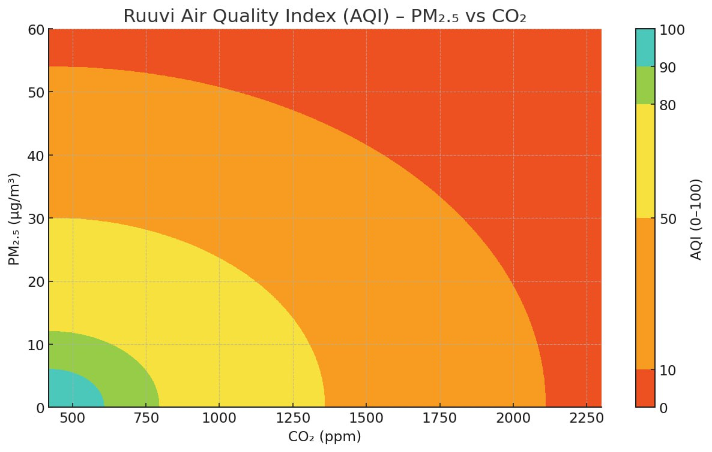

# Ruuvi Air Quality Index (RAQI)

The Ruuvi Air Quality Index is designed to give a quick, repeatable view to the healthiness of current indoor air conditions. The index does not account for temperature or humidity, as they are more closely related to comfort of people and maintenance of structures rather than health effects on people.&#x20;

The index is calculated by considering each individual component difference to ideal value and using geometric distance calculation to create a "total difference" to ideal value. RAQI considers CO2 and particulate matter.&#x20;

<table><thead><tr><th width="122">Grade</th><th width="176">RAQI</th><th width="191">CO2 (ppm)*</th><th>Particulate matter 2.5 ug/m^3*</th></tr></thead><tbody><tr><td>Excellent</td><td>90 ≤ RAQI ≤ 100</td><td>CO2 ≤ 600</td><td>PM2.5 ≤ 6</td></tr><tr><td>Good</td><td>80 ≤ RAQI &#x3C; 90</td><td>600 &#x3C; CO2 ≤ 800</td><td>6 &#x3C; PM2.5 ≤ 12</td></tr><tr><td>Fair</td><td>50 ≤ RAQI &#x3C; 80</td><td>800 &#x3C; CO2 ≤ 1400</td><td>12 &#x3C; PM2.5 ≤ 30</td></tr><tr><td>Poor</td><td>10 ≤ RAQI &#x3C; 50</td><td>1400 &#x3C; CO2 ≤ 2100</td><td>30 &#x3C; PM2.5 ≤ 55</td></tr><tr><td>Bad</td><td>0 ≤ RAQI &#x3C; 0</td><td>2100 &#x3C; CO2</td><td>55 &#x3C; PM2.5</td></tr></tbody></table>

\* The values have been rounded for clarity. The exact mathematical thresholds are 6, 12, 30, 54 for PM2.5 and 608, 796, 1360 and 2112 for CO2.&#x20;

Expressed as a graph, AQI maps to CO2 + PM2.5 as below:&#x20;

<figure><figcaption></figcaption></figure>

The RAQI is calculated by the formula below:&#x20;

```
const AQI_MAX    = 100;

const PM25_MAX   = 60,  PM25_MIN = 0;
const PM25_SCALE = AQI_MAX / (PM25_MAX - PM25_MIN);   // ≈ 1.6667

const CO2_MAX    = 2300, CO2_MIN = 420;
const CO2_SCALE  = AQI_MAX / (CO2_MAX - CO2_MIN);     // ≈ 0.05319

function clamp(x, lo, hi){ return Math.min(Math.max(x, lo), hi); }

function calc_aqi(pm25, co2) {
  if(isNaN(pm25) || isNaN(co2)) { return NaN; }

  pm25 = clamp(pm25, PM25_MIN, PM25_MAX);
  co2  = clamp(co2,  CO2_MIN,  CO2_MAX);

  const dx = (pm25 - PM25_MIN) * PM25_SCALE; // 0..100
  const dy = (co2  - CO2_MIN)  * CO2_SCALE;  // 0..100

  const r  = Math.hypot(dx, dy);             // sqrt(dx*dx + dy*dy)
  return clamp(AQI_MAX - r, 0, AQI_MAX);
}
```

