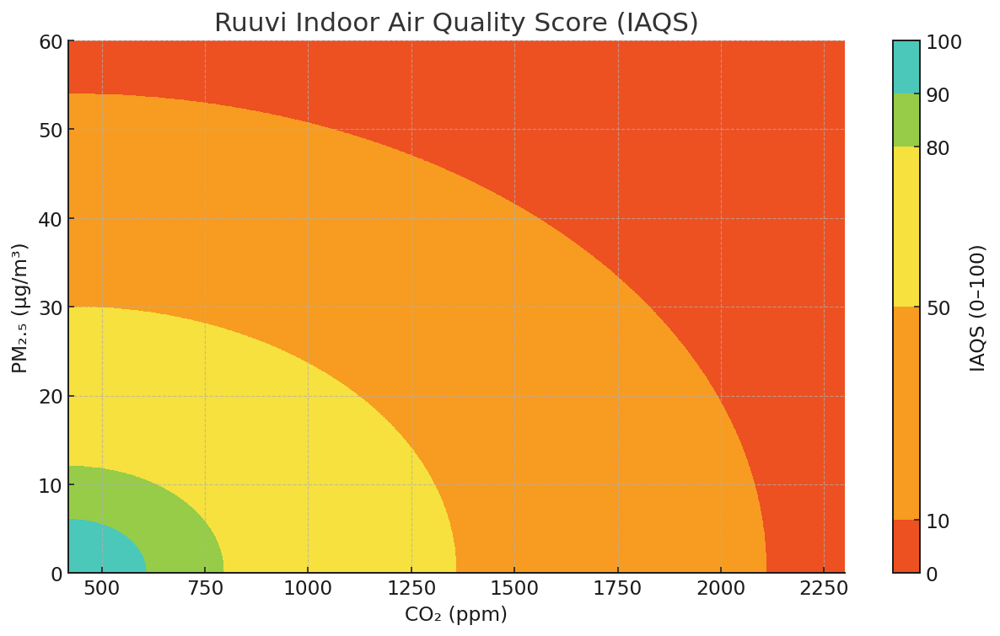

# Ruuvi Indoor Air Quality Score (IAQS)

The Ruuvi Indoor Air Quality Score is designed to give a quick, repeatable view to the healthiness of current indoor air conditions. The index does not account for temperature or humidity, as they are more closely related to comfort of people and maintenance of structures rather than health effects on people. RAQI considers CO2 and particulate matter as they can be measured as absolute values and science behind their impact to health and wellbeing is well studied.&#x20;

<table><thead><tr><th width="122">Grade</th><th width="176">IAQS</th><th width="191">CO2 (ppm)</th><th>Particulate matter 2.5 ug/m^3</th></tr></thead><tbody><tr><td>Excellent</td><td>90 ≤ IAQS ≤ 100</td><td>CO2 ≤ 600</td><td>PM2.5 ≤ 6</td></tr><tr><td>Good</td><td>80 ≤ IAQS &#x3C; 90</td><td>600 &#x3C; CO2 ≤ 800</td><td>6 &#x3C; PM2.5 ≤ 12</td></tr><tr><td>Fair</td><td>50 ≤ IAQS &#x3C; 80</td><td>800 &#x3C; CO2 ≤ 1400</td><td>12 &#x3C; PM2.5 ≤ 30</td></tr><tr><td>Poor</td><td>10 ≤ IAQS &#x3C; 50</td><td>1400 &#x3C; CO2 ≤ 2100</td><td>30 &#x3C; PM2.5 ≤ 55</td></tr><tr><td>Very Poor</td><td>0 ≤ IAQS &#x3C; 10</td><td>2100 &#x3C; CO2</td><td>55 &#x3C; PM2.5</td></tr></tbody></table>

Expressed as a graph, AQI maps to CO2 + PM2.5 as below:&#x20;

<figure><figcaption></figcaption></figure>

Ruuvi Station apps and Ruuvi Air display the grading of index by a value rounded to integer value. e.g. 89.6 becomes 90 and is listed as turquoise/excellent even though the original raw value is below the threshold. The history graphs likewise show the color as it was rounded, so a history graph with points 89.4, 89.5, 89.6 transitions green to turquoise at 89.5.
