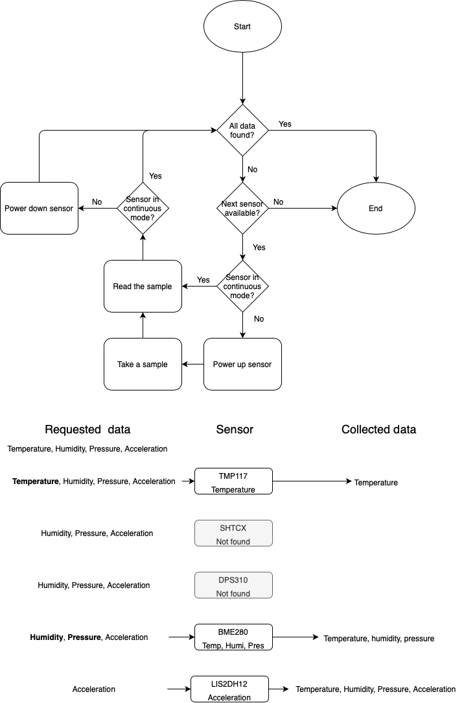

# 3.x Sensors

Each firmware targets a board with knowledge of what sensors there might be, and firmware manages missing sensors and overlapping data providers transparently for user. 

For example a board might have high-precision temperature sensor TMP117, temperature and humidity sensors SHTC3, pressure sensor DPS310, combined temperature, pressure and humidity sensor BME280 and accelerometer LIS2DH12 or accelerometer LIS2DW12. 

At boot the board checks each sensor at the pinout where it might be, and if sensor is found it will be initialized into state stored to flash. If there isn't a state stored to flash, the sensor will be booted into default settings and defaults are stored to flash. 

When application requires temperature, humidity, pressure and acceleration data, the sensors found at boot are queried in the order of initialization until all requested data is available or no more sensors remain for checking.

Some sensors, such as accelerometer, need to be constantly on to generate interrupts on events or to maintain digital signal processing to improve the quality of measurements. Others can be powered off until a new sample is needed. Generally sensors which are read rarely should be in a single-shot mode and sensors which are read at high frequency should be in continuous mode. 

## Test checklist

| Event | Test | Version | CI / Manual |
| :--- | :--- | :--- | :--- |
| Boot | Sensor configuration is loaded from flash. | 3.29+ | [CI](https://github.com/ruuvi/ruuvi.firmware.c/blob/9d8a7a862be9ad6ac6ab3676c55f873f6ba2d0a7/test/test_app_sensor.c#L63) |
| Boot | Sensor data is read in initialization priority | 3.29+ |  |
| Read | Single-shot sensors are powered up | 3.29+ |  |
| Read | Single-shot sensors take a new sample | 3.29+ |  |
| Read | Single-shot sensors are powered down | 3.29+ |  |

