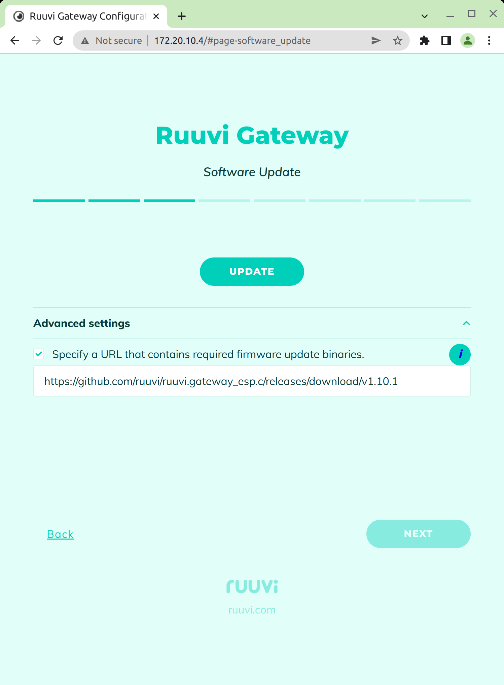
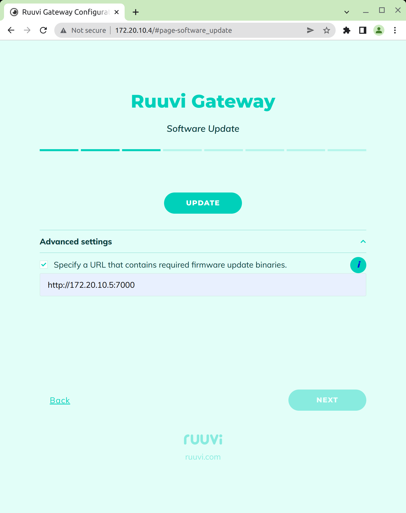

# GW Install custom firmware

## GW  Install previous firmware releases

Open Web-UI, go to "Software Update" page, expand "Advanced Settings", enable checkbox "Specify a URL that contains required firmware update binaries":



In the URL input field change the version number to the desired one, then press "UPDATE" button.

The list of released versions can be found here: [https://github.com/ruuvi/ruuvi.gateway\_esp.c/releases/](https://github.com/ruuvi/ruuvi.gateway\_esp.c/releases/)

## GW Install custom firmware

You need to prepare firmware binaries and put them on your HTTP server.

1\. First, you need to build firmware:

```bash
idf.py build
```

2\. Next, copy the firmware binaries to some folder (gw\_fw):

```
mkdir gw_fw
cd build
cp ruuvi_gateway_esp.bin fatfs_gwui.bin fatfs_nrf52.bin ../gw_fw
```

3\. Run local HTTP server on port 7000 in the folder with the firmware binaries:

```
cd ../gw_fw
python3 -m http.server 7000
```

Or instead of steps 2 and 3 you can simply run the local HTTP server in the "build" folder:

```
cd build
python3 -m http.server 7000
```

Then open Web-UI, go to "Software Update" page, expand "Advanced Settings", enable checkbox "Specify a URL that contains required firmware update binaries" and in the URL input field set the address of your local HTTP server, then press "UPDATE" button:



