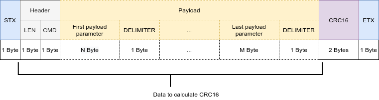

# GW nRF52811 UART communication

## Message format

The host and device (nRF52) communicate with each other via UART using the following message format:

Note 1: `LEN` field determines the length of the payload (`CMD` field is not included in `LEN`).\
Thus, the message with `LEN`=0 contains only the `CMD` byte and no `Payload`.

Note 2: CRC16 is calculated for `Header` (`LEN` and `CMD`) and `Payload`.

CRC is CRC-16-CCITT-FALSE, Polynomial Formula: x16+x12+x5+1,  Polynomial: 1021

### Defines

| Constant  | Value |
| --------- | ----- |
| STX       | 0xCA  |
| ETX       | 0x0A  |
| DELIMITER | 0x2C  |

## SET sequence

<figure><figcaption></figcaption></figure>

### Command format&#x20;

<table><thead><tr><th width="318">Command</th><th width="75">CMD</th><th width="267">Param</th><th width="128">Value</th></tr></thead><tbody><tr><td><code>RE_CA_UART_SET_FLTR_TAGS</code></td><td>0x05</td><td>Enable/disable BLE tags filter</td><td><code>0...1</code></td></tr><tr><td><code>RE_CA_UART_SET_FLTR_ID</code></td><td>0x06</td><td>Manufacturer ID to be filtered (uint16)</td><td><code>0...65535</code></td></tr><tr><td><code>RE_CA_UART_SET_CODED_PHY</code></td><td>0x07</td><td>Enable/disable BLE coded PHY</td><td><code>0...1</code></td></tr><tr><td><code>RE_CA_UART_SET_SCAN_1MB_PHY</code></td><td>0x08</td><td>Enable/disable BLE scan PHY</td><td><code>0...1</code></td></tr><tr><td><code>RE_CA_UART_SET_EXT_PAYLOAD</code></td><td>0x09</td><td>Enable/disable BLE extended payload</td><td><code>0...1</code></td></tr><tr><td><code>RE_CA_UART_SET_CH_37</code></td><td>0x0A</td><td>Enable/disable BLE channel 37</td><td><code>0...1</code></td></tr><tr><td><code>RE_CA_UART_SET_CH_38</code></td><td>0x0B</td><td>Enable/disable BLE channel 38</td><td><code>0...1</code></td></tr><tr><td><code>RE_CA_UART_SET_CH_39</code></td><td>0x0C</td><td>Enable/disable BLE channel 39</td><td><code>0...1</code></td></tr><tr><td><code>RE_CA_UART_LED_CTRL</code></td><td>0x0E</td><td>Turn on the LED for the specified time interval in milliseconds (uint16)</td><td><code>0...65535</code></td></tr></tbody></table>

<table><thead><tr><th width="231">Command</th><th width="75">CMD</th><th width="158">Param 1</th><th width="291">Param 2</th></tr></thead><tbody><tr><td><code>RE_CA_UART_SET_ALL</code></td><td>0x0F</td><td>Manufacturer ID to be filtered: <code>0...65535</code></td><td>Bit-mask (uint8) for all state flags: - bit 0: Filter tags - bit 1: BLE coded PHY - bit 2: BLE scan PHY - bit 3: BLE extended payload - bit 4: BLE chan 37 - bit 5: BLE chan 38 - bit 6: BLE chan 39</td></tr></tbody></table>

### Ack message&#x20;

<table><thead><tr><th width="191">Ack</th><th width="77">CMD</th><th width="354">Param 1</th><th width="110">Param 2</th></tr></thead><tbody><tr><td><code>RE_CA_UART_ACK</code></td><td>0x20</td><td>Command to which the ACK responds: <code>0x05...0x0C, 0x0F</code></td><td>Ack state: <code>0</code> - OK <code>1</code> - Error</td></tr></tbody></table>

#### Example: Set the state of channel 37

Command `RE_CA_UART_SET_CH_37`:

<table data-header-hidden><thead><tr><th width="81" align="center">STX</th><th width="73" align="center">LEN</th><th width="74" align="center">CMD</th><th width="84" align="center">State</th><th width="133" align="center">DELIMITER</th><th width="102" align="center">CRC16</th><th width="94" align="center">ETX</th></tr></thead><tbody><tr><td align="center">STX</td><td align="center">LEN</td><td align="center">CMD</td><td align="center">State</td><td align="center">DELIMITER</td><td align="center">CRC16</td><td align="center">ETX</td></tr><tr><td align="center">CA</td><td align="center">02</td><td align="center">0A</td><td align="center">01</td><td align="center">2C</td><td align="center">78B6</td><td align="center">0A</td></tr></tbody></table>

Complete message: `CA  02 0A 01 2C  B6 78 0A`

Ack `RE_CA_UART_ACK`:

<table data-header-hidden><thead><tr><th width="84" align="center">STX</th><th width="70" align="center">LEN</th><th width="71" align="center">CMD</th><th width="114" align="center">Command</th><th width="82" align="center">DELIMITER</th><th width="64" align="center">Ack</th><th width="85" align="center">DELIMITER</th><th width="85" align="center">CRC16</th><th align="center">ETX</th></tr></thead><tbody><tr><td align="center">STX</td><td align="center">LEN</td><td align="center">CMD</td><td align="center">Command</td><td align="center">DELIMITER</td><td align="center">Ack</td><td align="center">DELIMITER</td><td align="center">CRC16</td><td align="center">ETX</td></tr><tr><td align="center">CA</td><td align="center">04</td><td align="center">20</td><td align="center">0A</td><td align="center">2C</td><td align="center">00</td><td align="center">2C</td><td align="center">7EE7</td><td align="center">0A</td></tr></tbody></table>

Complete message: `CA  04 20 0A 2C 00 2C  E7 7E 0A`

#### Example: Set all configuration

Command `RE_CA_UART_SET_ALL:`

<table><thead><tr><th width="80" align="center">STX</th><th width="66" align="center">LEN</th><th width="72" align="center">CMD</th><th width="77">Filter ID</th><th width="83">DELIMITER</th><th width="103">State bit-mask</th><th width="85">DELIMITER</th><th width="88">CRC16</th><th width="64">ETX</th></tr></thead><tbody><tr><td align="center">CA</td><td align="center">05</td><td align="center">0F</td><td>0499</td><td>2C</td><td>7D</td><td>2C</td><td>6121</td><td>0A</td></tr></tbody></table>

Complete message: `CA  05 0F 99 04 2C 7D 2C  21 61 0A`

Ack `RE_CA_UART_ACK:`

<table><thead><tr><th width="82">STX</th><th width="70">LEN</th><th width="73">CMD</th><th width="112">Command</th><th width="84">DELIMITER</th><th width="64">Ack</th><th width="83">DELIMITER</th><th width="88">CRC16</th><th width="65">ETX</th></tr></thead><tbody><tr><td>CA</td><td>04</td><td>20</td><td>0F</td><td>2C</td><td>00</td><td>2C</td><td>C2A2</td><td>0A</td></tr></tbody></table>

Complete message: `CA  04 20 0F 2C 00 2C  A2 C2 0A`

## GET sequence

<figure><figcaption></figcaption></figure>

### Request message&#x20;

<table><thead><tr><th width="302">Request</th><th width="90">CMD</th><th width="250" align="center">Param</th></tr></thead><tbody><tr><td><code>RE_CA_UART_GET_DEVICE_ID</code></td><td>0x18</td><td align="center">-</td></tr></tbody></table>

### Response message&#x20;

<table><thead><tr><th width="249">Response</th><th width="74">CMD</th><th>Param 1</th><th>Param 2</th></tr></thead><tbody><tr><td><code>RE_CA_UART_DEVICE_ID</code></td><td>0x11</td><td>Device ID (8 bytes)</td><td>MAC Address (6 bytes)</td></tr></tbody></table>

#### Example: Request DEVICE\_ID

Command :

<table><thead><tr><th width="87">STX</th><th width="81">LEN</th><th width="87">CMD</th><th width="98">CRC16</th><th width="74">ETX</th></tr></thead><tbody><tr><td>CA</td><td>00</td><td>18</td><td>8E36</td><td>0A</td></tr></tbody></table>

Complete request message: `CA  00 18  36 8E 0A`

Response:

<table><thead><tr><th width="80">STX</th><th width="67">LEN</th><th width="72">CMD</th><th width="127">Device ID</th><th width="71" align="center">DELIMITER</th><th width="110">MAC Addr</th><th width="69">DELIMITER</th><th width="73">CRC16</th><th width="67">ETX</th></tr></thead><tbody><tr><td>CA</td><td>10</td><td>11</td><td>0x38E11A5878A79840</td><td align="center">2C</td><td>2C:9C:8E:2D:25:C8</td><td>2C</td><td>677F</td><td>0A</td></tr></tbody></table>

Complete response message: `CA  10 11 40 98 A7 78 58 1A E1 38 2C C8 25 2D 8E 9C 2C 2C  7F 67 0A`

## REPORT sequence

<figure><figcaption></figcaption></figure>

### Report message&#x20;

<table><thead><tr><th width="244">Report</th><th width="74">CMD</th><th width="102">Param 1</th><th>Param 2</th><th>Param 3</th></tr></thead><tbody><tr><td><code>RE_CA_UART_ADV_RPRT</code></td><td>0x10</td><td>MAC address (6 bytes)</td><td>Advertisement: <code>Variable length (MAX 31 Bytes)</code></td><td>RSSI in dB: <code>-128...127</code></td></tr></tbody></table>

Note: The length of the Advertisement is determined by the LEN field in the Header.\
Adv\_Len := LEN - 10

#### Example of report

<table><thead><tr><th width="80" align="center">STX</th><th width="67">LEN</th><th width="71">CMD</th><th width="87">MAC Addr</th><th width="71">DELIMITER</th><th width="130">Adv</th><th width="70">DELIMITER</th><th width="70">RSSI</th><th width="69">DELIMITER</th><th width="68">CRC16</th><th width="64">ETX</th></tr></thead><tbody><tr><td align="center">CA</td><td>29</td><td>10</td><td>06:AD:E0:B9:A5:C6</td><td>2C</td><td>02 01 06 1B FF 99 04 05 14 64 47 25 C4 41 00 34 00 00 04 1C A9 36 11 01 58 C6 A5 B9 E0 AD 06</td><td>2C</td><td>D9</td><td>2C</td><td>0811</td><td>0A</td></tr></tbody></table>

Complete report message: `CA  29 10 C6 A5 B9 E0 AD 06 2C 02 01 06 1B FF 99 04 05 14 64 47 25 C4 41 00 34 00 00 04 1C A9 36 11 01 58 C6 A5 B9 E0 AD 06 2C D9 2C  11 08 0A`

## `CONFIGURATION REQUEST sequence`

<figure><figcaption></figcaption></figure>

### CFG Request message

<table><thead><tr><th width="249">Request</th><th width="249">CMD</th><th align="center">Param</th></tr></thead><tbody><tr><td>RE_CA_UART_GET_ALL</td><td>0x19</td><td align="center">-</td></tr></tbody></table>

#### Example: Configuration request on the device side

<table><thead><tr><th width="85" align="center">STX</th><th width="70" align="center">LEN</th><th width="82" align="center">CMD</th><th width="170" align="center">CRC16</th><th width="171" align="center">ETX</th></tr></thead><tbody><tr><td align="center">CA</td><td align="center">00</td><td align="center">19</td><td align="center">9E17</td><td align="center">0A</td></tr></tbody></table>

Complete configuration request message: `CA  00 19  17 9E 0A`
