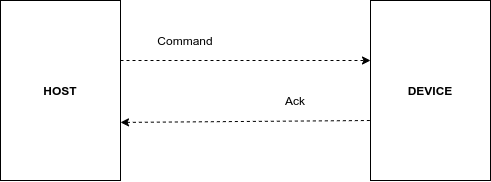
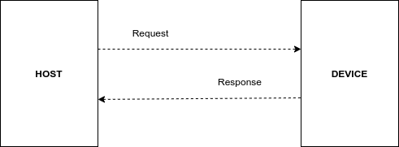
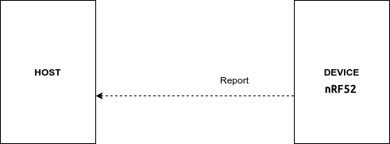

# GW nRF52811 UART communication

## Message format

### Defines

| Constant | Value |
| :--- | :--- |
| STX | `0xCA` |
| ETX | `0x0A` |
| DELIMITER | `0x2C` |

## SET sequence

### Command payload format 

| Command | Num | Param | Description | Value |
| :--- | :--- | :--- | :--- | :--- |
| `RE_CA_UART_SET_FLTR_TAGS` | 5 | State | Enable/disable BLE tags filter | `0...1` |
| `RE_CA_UART_SET_FLTR_ID` | 6 | Id | Manufacture id to be filtered | `0...65535` |
| `RE_CA_UART_SET_CODED_PHY` | 7 | State | Enable/disable BLE coded PHY | `0...1` |
| `RE_CA_UART_SET_SCAN_1MB_PHY` | 8 | State | Enable/disable BLE scan PHY | `0...1` |
| `RE_CA_UART_SET_EXT_PAYLOAD` | 9 | State | Enable/disable BLE extended payload | `0...1` |
| `RE_CA_UART_SET_CH_37` | 10 | State | Enable/disable BLE channel 37 | `0...1` |
| `RE_CA_UART_SET_CH_38` | 11 | State | Enable/disable BLE channel 38 | `0...1` |
| `RE_CA_UART_SET_CH_39` | 12 | State | Enable/disable BLE channel 39 | `0...1` |
| `RE_CA_UART_SET_ALL` | 15 | Filter Id | Manufacture id to be filtered | `0...65535` |
|  |  | Filter tags state | Enable/disable BLE tags filter | `0...1` |
|  |  | Coded PHY state | Enable/disable BLE coded PHY | `0...1` |
|  |  | Scan PHY state | Enable/disable BLE scan PHY | `0...1` |
|  |  | Extended payload state | Enable/disable BLE extended payload | `0...1` |
|  |  | Channel 37 state | Enable/disable BLE channel 37 | `0...1` |
|  |  | Channel 38 state | Enable/disable BLE channel 38 | `0...1` |
|  |  | Channel 39 state | Enable/disable BLE channel 39 | `0...1` |

### Ack payload format 

| Ack | Num | Param | Description | Value |
| :--- | :--- | :--- | :--- | :--- |
| `RE_CA_UART_ACK` | 32 | Command | Type of command | `5...15` |
|  |  | Ack | Ack state | `0...1` |

#### Example

Command `RE_CA_UART_SET_CH_37`:

| STX | LEN | CMD | State | DELIMITER | CRC16 | ETX |
| :---: | :---: | :---: | :---: | :---: | :---: | :---: |
| CA | 02 | 0A | 01 | 2C | 78B6 | 0A |

Complete message: `0xCA020A012CB6780A`

Ack `RE_CA_UART_ACK`:

| STX | LEN | CMD | Command | DELIMITER | Ack | DELIMITER | CRC16 | ETX |
| :---: | :---: | :---: | :---: | :---: | :---: | :---: | :---: | :---: |
| CA | 04 | 20 | 0A | 2C | 01 | 2C | 4DD6 | 0A |

Complete message: `0xCA04200A2C012CD64D0A`

## GET sequence

### Request payload format 

| Request | Num | Param | Description | Value |
| :--- | :--- | :--- | :--- | :--- |
| `RE_CA_UART_GET_DEVICE_ID` | 24 | - | - | - |

### Response payload format 

| Request | Num | Param | Description | Value |
| :--- | :--- | :--- | :--- | :--- |
| `RE_CA_UART_DEVICE_ID` | 17 | Id | Device id | `0...2^64 − 1` |
|  |  | Addr | Device address | `0...2^64 − 1` |

## REPORT sequence

### Report payload format 

| Request | Num | Param | Description | Value |
| :--- | :--- | :--- | :--- | :--- |
| `RE_CA_UART_ADV_RPRT` | 16 | Mac | MAC address | `6 Bytes` |
| \`\` |  | Adv | Advertisement | `Variable length(MAX 31 Bytes)` |
|  |  | Adv length | Advertisement length | `0...31` |
|  |  | RSSI | RSSI in dB | `-128...127` |

