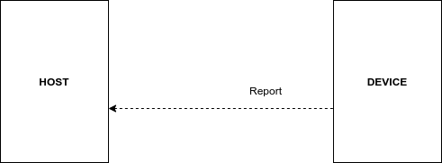
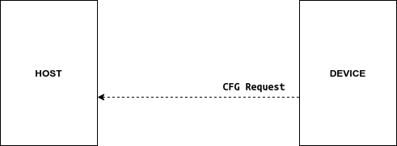

# GW nRF52811 UART communication

## Message format

The host and device (nRF52) communicate with each other via UART using the following message format:

Note 1: `LEN` field determines the length of the payload (`CMD` field is not included in `LEN`).\
Thus, the message with `LEN`=0 contains only the `CMD` byte and no `Payload`.

Note 2: CRC16 is calculated for `Header` (`LEN` and `CMD`) and `Payload`.

CRC is CRC-16-CCITT-FALSE, Polynomial Formula: x16+x12+x5+1,  Polynomial: 1021

### Defines

| Constant  | Value |
| --------- | ----- |
| STX       | 0xCA  |
| ETX       | 0x0A  |
| DELIMITER | 0x2C  |

## SET sequence

<figure><figcaption></figcaption></figure>

### Command format&#x20;

| Command                       | CMD  | Param                                                                    | Value       |
| ----------------------------- | ---- | ------------------------------------------------------------------------ | ----------- |
| `RE_CA_UART_SET_FLTR_TAGS`    | 0x05 | Enable/disable BLE tags filter                                           | `0...1`     |
| `RE_CA_UART_SET_FLTR_ID`      | 0x06 | Manufacturer ID to be filtered (uint16)                                  | `0...65535` |
| `RE_CA_UART_SET_CODED_PHY`    | 0x07 | Enable/disable BLE coded PHY                                             | `0...1`     |
| `RE_CA_UART_SET_SCAN_1MB_PHY` | 0x08 | Enable/disable BLE scan PHY                                              | `0...1`     |
| `RE_CA_UART_SET_EXT_PAYLOAD`  | 0x09 | Enable/disable BLE extended payload                                      | `0...1`     |
| `RE_CA_UART_SET_CH_37`        | 0x0A | Enable/disable BLE channel 37                                            | `0...1`     |
| `RE_CA_UART_SET_CH_38`        | 0x0B | Enable/disable BLE channel 38                                            | `0...1`     |
| `RE_CA_UART_SET_CH_39`        | 0x0C | Enable/disable BLE channel 39                                            | `0...1`     |
| `RE_CA_UART_LED_CTRL`         | 0x0E | Turn on the LED for the specified time interval in milliseconds (uint16) | `0...65535` |

| Command              | CMD  | Param 1                                                          | Param 2                                                                                                                                                                                                                          |
| -------------------- | ---- | ---------------------------------------------------------------- | -------------------------------------------------------------------------------------------------------------------------------------------------------------------------------------------------------------------------------- |
| `RE_CA_UART_SET_ALL` | 0x0F | 
Manufacturer ID to be filtered: <code>0...65535</code>
 | 
Bit-mask (uint8) for all state flags: - bit 0: Filter tags - bit 1: BLE coded PHY - bit 2: BLE scan PHY - bit 3: BLE extended payload - bit 4: BLE chan 37 - bit 5: BLE chan 38 - bit 6: BLE chan 39
 |

### Ack message&#x20;

| Ack              | CMD  | Param 1                                                                     | Param 2                                                            |
| ---------------- | ---- | --------------------------------------------------------------------------- | ------------------------------------------------------------------ |
| `RE_CA_UART_ACK` | 0x20 | 
Command to which the ACK responds: <code>0x05...0x0C, 0x0F</code>
 | 
Ack state: <code>0</code> - OK <code>1</code> - Error
 |

#### Example: Set the state of channel 37

Command `RE_CA_UART_SET_CH_37`:

| STX | LEN | CMD | State | DELIMITER | CRC16 | ETX |
| :-: | :-: | :-: | :---: | :-------: | :---: | :-: |
|  CA |  02 |  0A |   01  |     2C    |  78B6 |  0A |

Complete message: `CA  02 0A 01 2C  B6 78 0A`

Ack `RE_CA_UART_ACK`:

| STX | LEN | CMD | Command | DELIMITER | Ack | DELIMITER | CRC16 | ETX |
| :-: | :-: | :-: | :-----: | :-------: | :-: | :-------: | :---: | :-: |
|  CA |  04 |  20 |    0A   |     2C    |  00 |     2C    |  7EE7 |  0A |

Complete message: `CA  04 20 0A 2C 00 2C  E7 7E 0A`

#### Example: Set all configuration

Command `RE_CA_UART_SET_ALL:`

| STX | LEN | CMD | Filter ID | DELIMITER | State bit-mask | DELIMITER | CRC16 | ETX |
| :-: | :-: | :-: | --------- | --------- | -------------- | --------- | ----- | --- |
|  CA |  05 |  0F | 0499      | 2C        | 7D             | 2C        | 6121  | 0A  |

Complete message: `CA  05 0F 99 04 2C 7D 2C  21 61 0A`

Ack `RE_CA_UART_ACK:`

| STX | LEN | CMD | Command | DELIMITER | Ack | DELIMITER | CRC16 | ETX |
| --- | --- | --- | ------- | --------- | --- | --------- | ----- | --- |
| CA  | 04  | 20  | 0F      | 2C        | 00  | 2C        | C2A2  | 0A  |

Complete message: `CA  04 20 0F 2C 00 2C  A2 C2 0A`

## GET sequence

<figure><figcaption></figcaption></figure>

### Request message&#x20;

| Request                    | CMD  | Param |
| -------------------------- | ---- | :---: |
| `RE_CA_UART_GET_DEVICE_ID` | 0x18 |   -   |

### Response message&#x20;

| Response               | CMD  | Param 1                       | Param 2                         |
| ---------------------- | ---- | ----------------------------- | ------------------------------- |
| `RE_CA_UART_DEVICE_ID` | 0x11 | 
Device ID (8 bytes)
 | 
MAC Address (6 bytes)
 |

#### Example: Request DEVICE\_ID

Command :

| STX | LEN | CMD | CRC16 | ETX |
| --- | --- | --- | ----- | --- |
| CA  | 00  | 18  | 8E36  | 0A  |

Complete request message: `CA  00 18  36 8E 0A`

Response:

| STX | LEN | CMD | Device ID          | DELIMITER | MAC Addr          | DELIMITER | CRC16 | ETX |
| --- | --- | --- | ------------------ | --------- | ----------------- | --------- | ----- | :-: |
| CA  | 10  | 11  | 0x38E11A5878A79840 | 2C        | 2C:9C:8E:2D:25:C8 | 2C        | 677F  |  0A |

Complete response message: `CA  10 11 40 98 A7 78 58 1A E1 38 2C C8 25 2D 8E 9C 2C 2C  7F 67 0A`

## REPORT sequence

<figure><figcaption></figcaption></figure>

### Report message&#x20;

| Report                | CMD  | Param 1                         | Param 2                                                              | Param 3                                       |
| --------------------- | ---- | ------------------------------- | -------------------------------------------------------------------- | --------------------------------------------- |
| `RE_CA_UART_ADV_RPRT` | 0x10 | 
MAC address (6 bytes)
 | 
Advertisement: <code>Variable length (MAX 31 Bytes)</code>
 | 
RSSI in dB: <code>-128...127</code>
 |

Note: The length of the Advertisement is determined by the LEN field in the Header.\
Adv\_Len := LEN - 10

#### Example of report

| STX | LEN | CMD | MAC Addr          | DELIMITER | Adv                                                                                          | DELIMITER | RSSI | DELIMITER | CRC16 | ETX |
| :-: | --- | --- | ----------------- | --------- | -------------------------------------------------------------------------------------------- | --------- | ---- | --------- | ----- | --- |
|  CA | 29  | 10  | 06:AD:E0:B9:A5:C6 | 2C        | 02 01 06 1B FF 99 04 05 14 64 47 25 C4 41 00 34 00 00 04 1C A9 36 11 01 58 C6 A5 B9 E0 AD 06 | 2C        | D9   | 2C        | 0811  | 0A  |

Complete report message: `CA  29 10 C6 A5 B9 E0 AD 06 2C 02 01 06 1B FF 99 04 05 14 64 47 25 C4 41 00 34 00 00 04 1C A9 36 11 01 58 C6 A5 B9 E0 AD 06 2C D9 2C  11 08 0A`

## `CONFIGURATION REQUEST sequence`

<figure><figcaption></figcaption></figure>

### CFG Request message

| Request                | CMD  | Param |
| ---------------------- | ---- | :---: |
| RE\_CA\_UART\_GET\_ALL | 0x19 |   -   |

#### Example: Configuration request on the device side

| STX | LEN | CMD | CRC16 | ETX |
| :-: | :-: | :-: | :---: | :-: |
|  CA |  00 |  19 |  9E17 |  0A |

Complete configuration request message: `CA  00 19  17 9E 0A`
