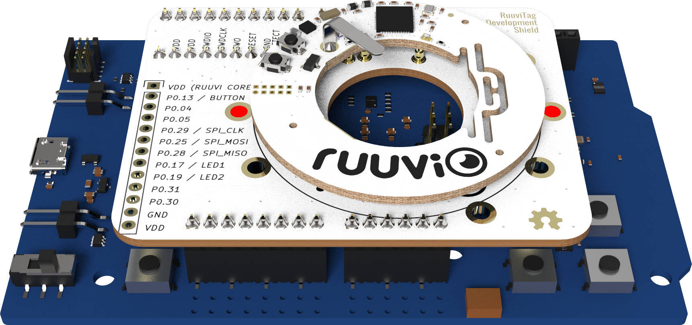

# Ruuvi DevShield

The development shield allows easy access to the RuuviTag's [test points](https://lab.ruuvi.com/\[\[\~36]]).

This enables easy debugging with a logic analyzer while developing drivers for sensors onboard or attaching external sensors to RuuviTag.

<figure><figcaption></figcaption></figure>

We recommend attaching RuuviTag to the developer shield with a single zip tie. Use the holes marked in red.

It's highly recommended to keep the development board unpowered while adjusting the connections to avoid any short circuits.

### Do I need one?

If you're interested only in making a connection to RuuviTag's SWD _(Serial Wire Debug)_ port for debugging purposes, this can also be done without a DevShield. See [RuuviTag's pinout](https://lab.ruuvi.com/\[\[\~36]]) for more info.

You can use [Segger's J-Link RTT](https://www.segger.com/products/debug-probes/j-link/technology/real-time-transfer/rtt-viewer/) viewer and read the log messages in code through USB, or you can attach a USB-serial adapter to pins on the board and redirect the log messages to the USB port. Using SEGGER JLINK is detailed [here](https://blog.ruuvi.com/debugging-ruuvitag-fbb6a42371c). To get started, just set up the pins and RTT/UART as a log backend in _project/sdk\_application\_config.h_ or _project/board/config/sdk\_board\_config.h_.

One interesting possibility is to activate GPIO pins during tasks in the program and then check those pins with a logic analyzer. This helps you to visualize where the program is spending most of its time and allows you to optimize parts of the code that matter the most.

When your code is ready, don't forget to check the power consumption with [Nordic Power Profiler Kit](https://www.nordicsemi.com/eng/Products/Power-Profiler-Kit). Example on using power profiler can be found [here](https://blog.ruuvi.com/power-profiling-718418ab9445). Once you're happy with the application, you can [release the program binaries](https://blog.ruuvi.com/preparing-binaries-2b76ab734a7e) to wild.
