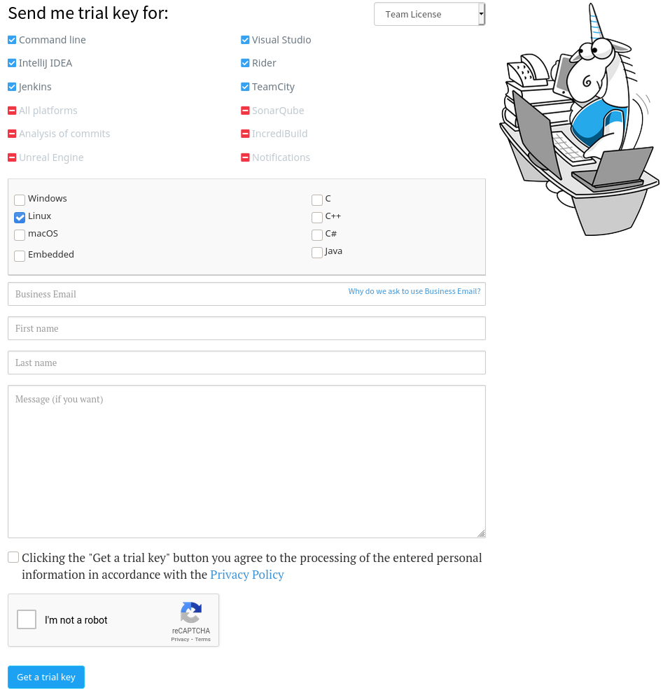

# PVS Studio

Note: the tutorial is tested on Linux machine.

The Ruuvi Firmware may be compiled with the Makefile by running **make** command inside the _ruuvi.firmware.c_ project folder. To build the project, PVS Studio, the static code analyzer, has to be installed and a trial/full license key has to be entered. 

Download the PVS Studio from project webpage: [https://pvs-studio.com/en/pvs-studio-download/](https://pvs-studio.com/en/pvs-studio-download/) On the same webpage, you can get the trial key, which is essential for PVS Studio to run:



After the installation process, you can add the trial license key previously received via email:

```text
$pvs-studio-analyzer credentials NAME XXXX-XXXX-XXXX-XXXX
```

Now when you compile with **make** you'll get the confirmation for successful PVS Studio analysis:

```text
$Analyzer log conversion tool.
Copyright (c) 2021 PVS-Studio LLC

PVS-Studio is a static code analyzer and SAST (static application security
testing) tool that is available for C and C++ desktop and embedded development,
C# and Java under Windows, Linux and macOS.

Total messages: 286
Filtered messages: 239
plog-converter -a 'GA:1;OP:1;CS:1;MISRA:1' -t errorfile src/main.o.PVS-Studio.log src/run_integration_tests.o.PVS-Studio.log src/app_button.o.PVS-Studio.log src/app_comms.o.PVS-Studio.log src/app_heartbeat.o.PVS-Studio.log src/app_led.o.PVS-Studio.log src/app_log.o.PVS-Studio.log src/app_power.o.PVS-Studio.log src/app_sensor.o.PVS-Studio.log -o ./pvs.error
Analyzer log conversion tool.
Copyright (c) 2021 PVS-Studio LLC

PVS-Studio is a static code analyzer and SAST (static application security
testing) tool that is available for C and C++ desktop and embedded development,
C# and Java under Windows, Linux and macOS.

Total messages: 286
Filtered messages: 1
```


